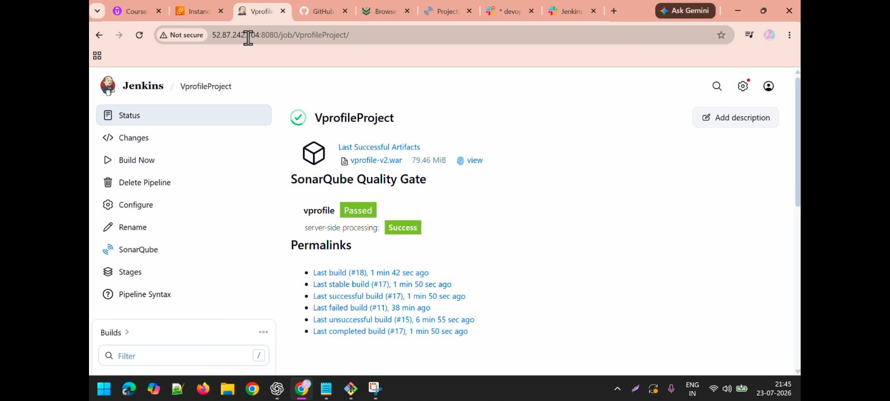
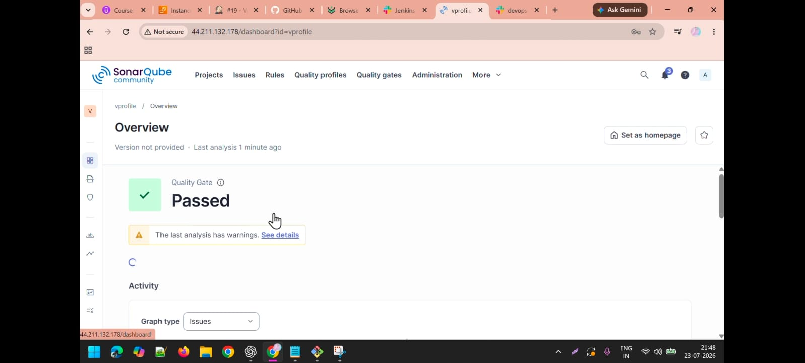
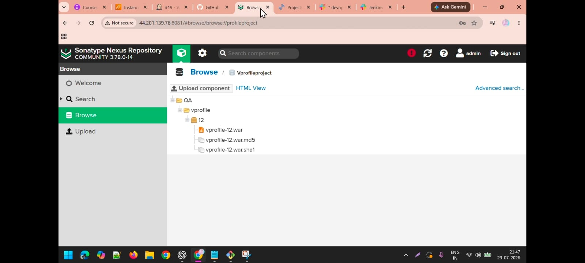
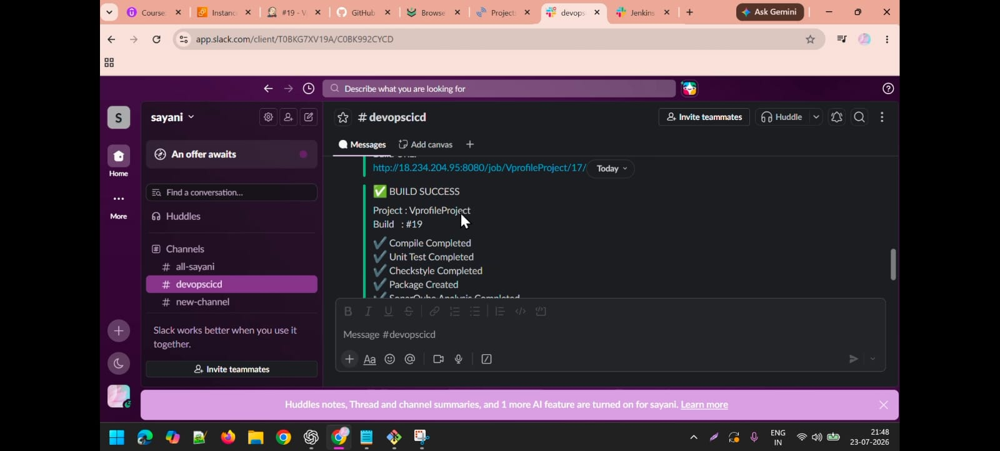
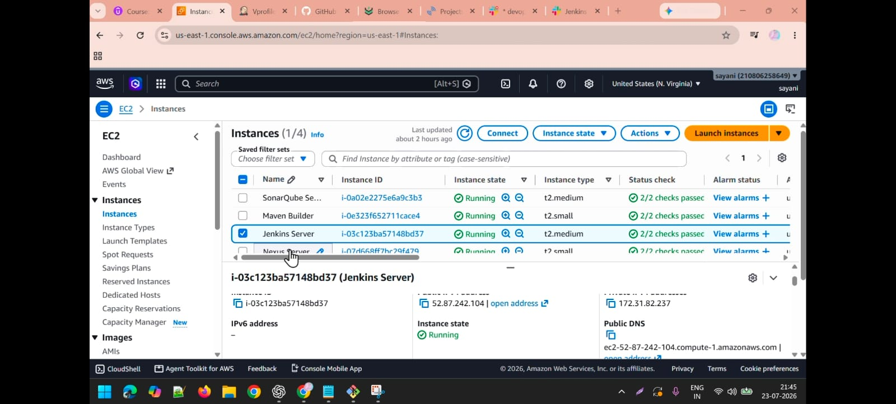

# VProfile CI/CD Pipeline Automation

## Project Overview

Implemented an end-to-end CI/CD pipeline for the VProfile Java application using Jenkins. The pipeline automates the complete software delivery process including source code checkout, build, testing, code quality analysis, artifact management, and build notifications.

The project demonstrates real-time DevOps practices by integrating Jenkins with GitHub, Maven, SonarQube, Nexus Repository, and Slack.

---

# DevOps Tools Used

- GitHub - Source Code Management
- Jenkins - CI/CD Pipeline Automation
- Maven - Build and Dependency Management
- SonarQube - Code Quality and Static Code Analysis
- Checkstyle - Code Standard Validation
- Nexus Repository - Artifact Repository Management
- Slack - Build Status Notifications

---

# CI/CD Pipeline Workflow
Developer
|
↓
GitHub Repository
|
↓
Jenkins Pipeline
|
↓
Clean Workspace
|
↓
Checkout Source Code
|
↓
Verify Java & Maven Tools
|
↓
Compile Application
|
↓
Run Unit Tests
|
↓
Checkstyle Code Analysis
|
↓
Package Application (.war)
|
↓
Archive Artifact
|
↓
SonarQube Code Analysis
|
↓
Upload Artifact to Nexus Repository
|
↓
Slack Notification

---

# Jenkins Pipeline Stages

## 1. Clean Workspace

Jenkins removes previous workspace files before starting a new build to ensure a clean execution environment.

Tool Used:
- Jenkins Clean Workspace Plugin

---

## 2. Checkout Source Code

Jenkins pulls the latest application code from GitHub.

Repository:

https://github.com/hkhcoder/vprofile-project.git

Branch:

atom

---

## 3. Verify Build Tools

Verified required build tools before execution.

Tools:

- JDK 21
- Maven 3.9

Commands:

java -version

mvn -version

---

## 4. Compile Application

Compiled the application source code using Maven.

Command:

mvn clean compile

---

## 5. Unit Testing

Executed automated unit tests to validate application functionality.

Command:

mvn test

---

## 6. Checkstyle Analysis

Integrated Checkstyle to validate coding standards and maintain code quality.

Command:

mvn checkstyle:checkstyle

---

## 7. Package Application

Created the deployable WAR artifact.

Command:

mvn package -DskipTests

Generated Artifact:

target/vprofile-v2.war

---

## 8. Archive Artifact

Archived generated build artifacts in Jenkins.

Features:

- Artifact storage
- Fingerprint tracking

---

## 9. SonarQube Code Analysis

Integrated SonarQube with Jenkins for automated code quality analysis.

Performed checks:

- Bugs detection
- Vulnerability analysis
- Code smells identification
- Code quality monitoring

SonarQube Scanner command:

sonar-scanner

Quality analysis is performed before artifact delivery.

---

## 10. Upload Artifact to Nexus Repository

Uploaded the generated WAR artifact to Nexus Repository after successful build and analysis.

Repository:

Vprofileproject

Artifact:

vprofile-v2.war

Nexus provides:

- Centralized artifact storage
- Version management
- Release management

---

## 11. Slack Notification

Integrated Jenkins with Slack for automated build notifications.

### Successful Build Notification

Notification sent after successful completion of:

✔ Compile  
✔ Unit Test  
✔ Checkstyle Analysis  
✔ Package Creation  
✔ SonarQube Analysis  
✔ Nexus Artifact Upload  

Example:

✅ BUILD SUCCESS

Project : vprofile
Build : #Build_Number

✔ Compile Completed
✔ Unit Test Completed
✔ Checkstyle Completed
✔ Package Created
✔ SonarQube Analysis Completed
✔ Artifact Uploaded to Nexus

---

### Failed Build Notification

If any pipeline stage fails, Jenkins sends a failure notification with the build URL for troubleshooting.

Example:

❌ BUILD FAILED

Project : vprofile

Please check Jenkins Console Output.

---

# CI/CD Pipeline Architecture

GitHub
|
↓
Jenkins
|
├── Maven Build
|
├── Unit Testing
|
├── Checkstyle Analysis
|
├── SonarQube
|
├── Nexus Repository
|
└── Slack Notification

---

# Application Details

## Prerequisites

- JDK 17 or 21
- Maven 3.9
- MySQL 8

---

## Jenkins Pipeline

## SonarQube Analysis

## Nexus Repository

## Slack Notification

## Pipeline

## Aws EC2 servers

